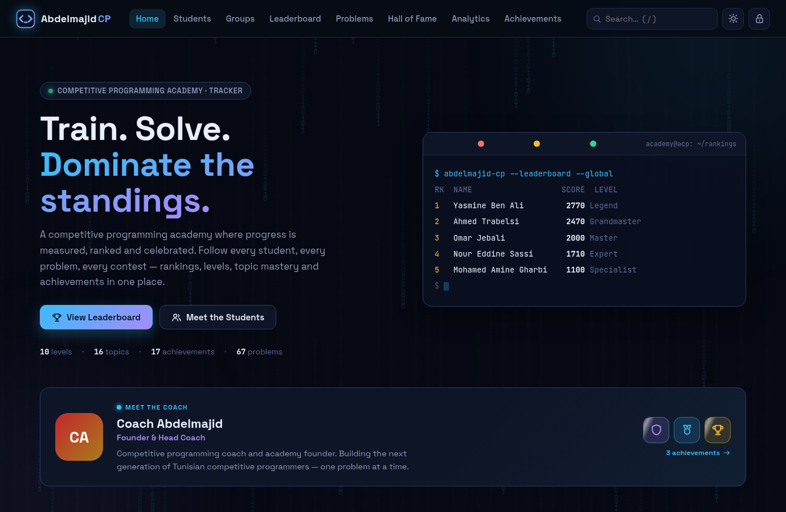
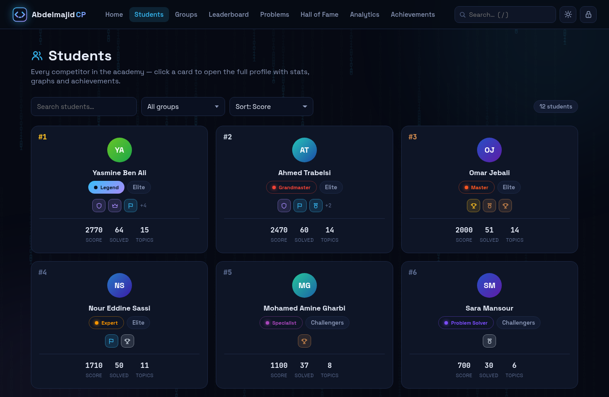
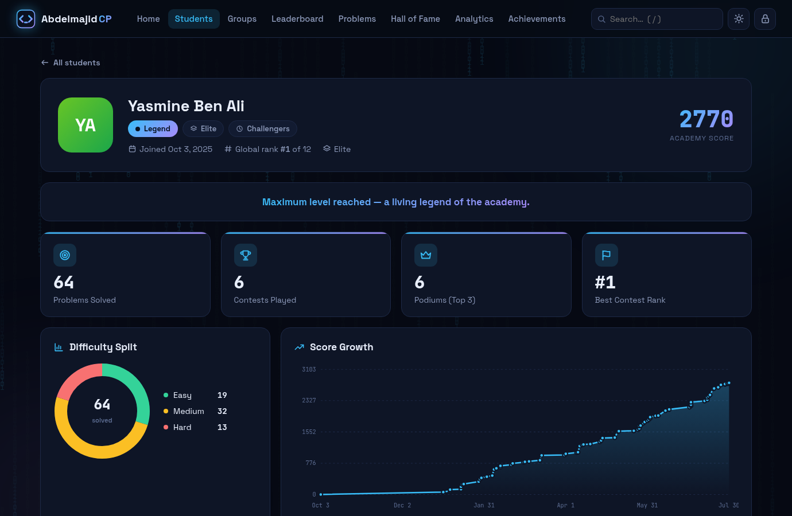
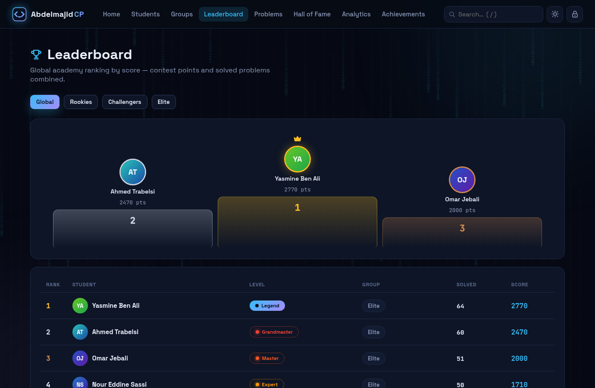
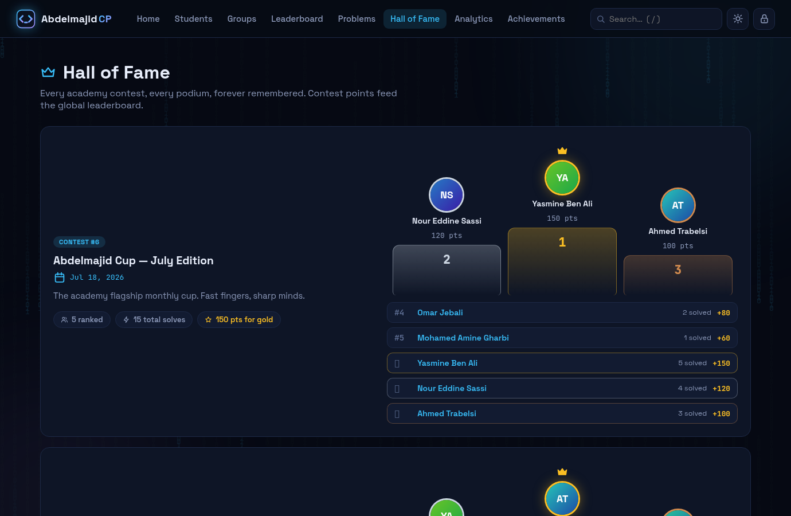
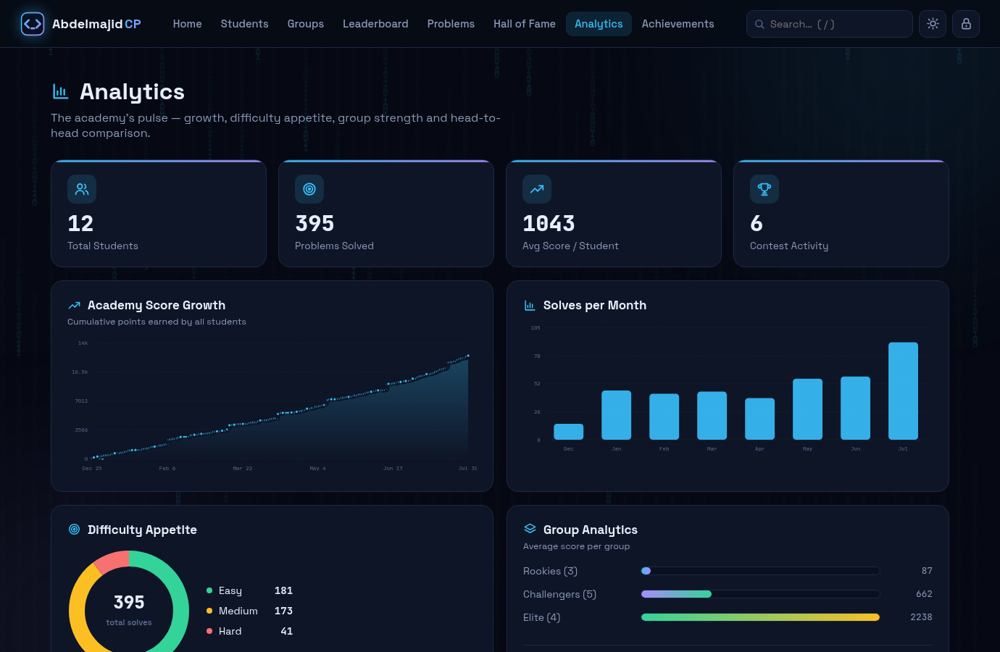
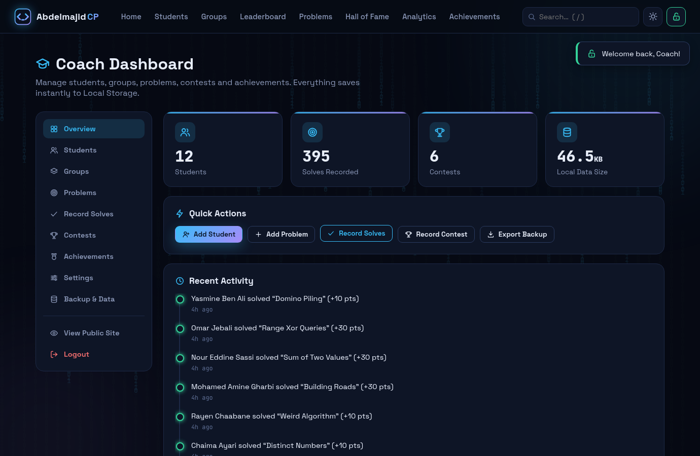
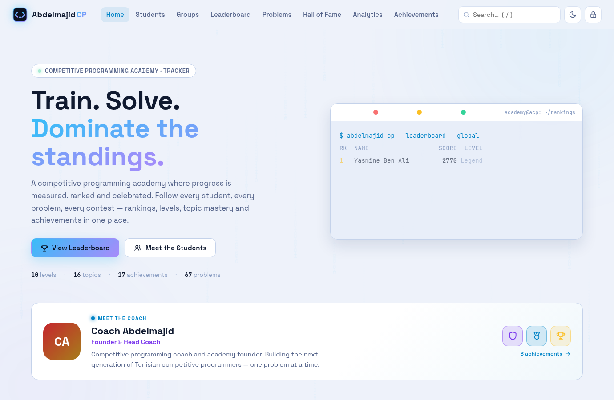
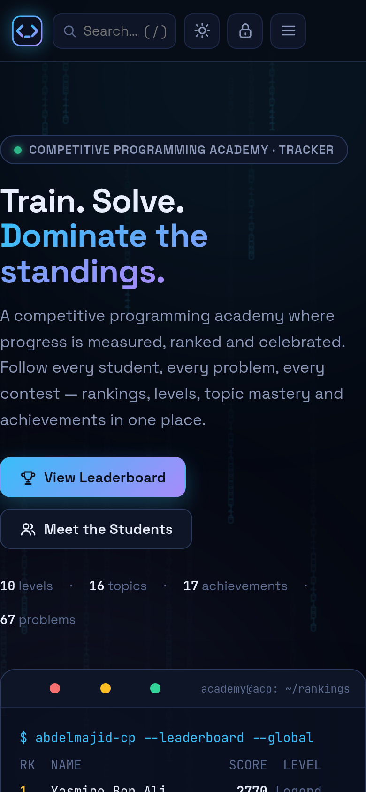

# Abdelmajid CP

**A competitive programming academy progress tracking platform** — fully frontend, no backend, no database, no build step.

Abdelmajid CP is a public dashboard & showcase for a competitive programming academy: students follow their improvement, problems, scores, rankings, achievements and contest history — while the coach manages everything from a password-protected admin panel. All data lives in the browser's **Local Storage**.



<details>
<summary>📸 More screenshots</summary>

| | |
|---|---|
|  |  |
|  |  |
|  |  |
|  |  |

</details>

---

## ✨ Features

### Public site (no account needed)
- **Home** — hero with live leaderboard terminal, a **“Meet the Coach”** section (photo, bio, coach achievements), academy statistics, recent activity timeline, featured students, Hall of Fame preview, ranking ladder.
- **Students** — searchable/filterable cards with photo, group, level, score, solves and achievements.
- **Student profiles** — full info, previous groups, global rank, next-level progress, weekly solve streak, difficulty donut, score-growth / problems-solved / contest-performance charts, topic mastery (XP + mastered badges), achievement wall, solve & contest history.
- **Groups** — members, assigned problems, own leaderboard, group analytics and average-score growth.
- **Leaderboard** — global podium + per-group rankings.
- **Problem library** — topic/difficulty filters, score & XP values, group assignment, solved-by counts.
- **Hall of Fame** — every contest with its podium, full standings, solves and points.
- **Join the Academy** (`#/join`) — a dedicated page with a public application form (name, age, email, level, optional message) plus a **“Just have a question?”** form for people asking without applying (same info + a question box). Both land in the coach's inbox — in the cloud when Supabase is configured, otherwise in the browser. A glowing call-to-action on the home page (right before the coach section) leads to it.
- **Achievements** — tiered catalog (Bronze → Legendary) with holders.
- **Analytics** — academy score growth, solves per month, difficulty appetite, group analytics, group×topic mastery matrix, and a 2–4 student comparison (table, overlaid growth chart, radar chart).

### Coach admin panel (password protected)
- Login with a locally stored password (**default: `admin123`** — change it in *Settings*).
- Manage **students** (add/edit/delete, photo upload, group moves with history, award achievements, **manual adjustments** — add score ± and extra Easy/Medium/Hard solves on top of recorded results, e.g. for external progress).
- Edit the **Coach Profile** shown on the home page (photo, name, title, bio, coach achievements from the shared catalog).
- Manage **groups** (create/edit/delete, move students).
- Manage **problems** (library, difficulty → auto score/XP, assign to groups, custom topics).
- **Record solves** — pick a problem, tick students; score, topic XP, leaderboards, levels and analytics update automatically.
- Record **contests** (as many ranks as you like — not just Top-5; points auto-baked per rank, with a configurable value for everyone #6 and below).
- **Join Requests & Questions inbox** — read/mark-read/delete applications and visitor questions sent from the Join page, with a one-click copy of the SQL needed to receive them in the cloud.
- Design **achievements** (name, series, tier, icon).
- **Settings** — academy name/tagline, scoring rules, contest points per rank, fully editable **level requirements** and **topic mastery XP**, change password.
- **Backup & data** — export everything as JSON, import a JSON backup, restore demo data, erase content, factory reset.

### Platform
- 🌙 Dark / ☀️ light themes, responsive design, smooth animations, scroll reveals, count-ups, confetti & badge shine effects.
- ⌨️ Global search (press `/`), works for students, problems, groups, contests, achievements.
- 💾 Local Storage only — no accounts, no servers, works from a plain `file://` open.
- 🧰 Zero dependencies, zero build — plain HTML/CSS/JS, easy to modify.

---

## 🚀 Running

No installation needed:

```bash
# option 1 — just open it
open index.html            # macOS
start index.html           # Windows
xdg-open index.html        # Linux

# option 2 — serve it (recommended)
python3 -m http.server 8000
# → http://localhost:8000
```

The site ships with a **demo academy** (12 students, 3 groups, 67 real problems, 6 contests) so every page is alive immediately. A coach can wipe or replace it anytime from **Admin → Backup & Data**.

## 🔑 Admin access

1. Open **Admin Panel** from the top-right lock icon (or `#/admin`).
2. Default password on first run: **`admin123`** — the app shows a **red security banner** until you change it in **Settings → Change Admin Password** (8+ chars, and it refuses `admin123`/`password`).

## 🛡 Security model

Honest about what protects what — this is a **frontend-only** app, so the
security comes from the cloud server, not from hiding things in the browser:

**Public by design (and safe):**
- The **anon API key** and **coach email** in `js/supabase-config.js` are *meant* to be visible. The anon key is a public read-key: Row-Level Security only lets it **read** the shared data and **insert** join-requests/questions. It can never edit, delete, or read other people's messages.
- The **source code** is open (MIT). Security here comes from server-side rules (RLS + Supabase Auth), never from hiding code.

**Hardened:**
- Passwords are stored as **PBKDF2-HMAC-SHA256** (120,000 iterations, random salt) — old builds used a weak 53-bit hash; existing installs **auto-upgrade silently** on the next login.
- The password hash **never leaves the device**: it is stripped from every cloud upload (the shared cloud document is publicly readable), and if an old build already leaked a hash into the cloud doc, the app **removes it automatically** at your next sign-in (you'll see a confirmation toast + a "🛡 no secrets stored in the cloud" chip in Backup & Data).
- **One password for both gates**: signing in online also sets the offline password to match, and changing the password in Settings updates local + cloud together. A wrong *cloud* password is a hard fail online — the local fallback only unlocks when the network is genuinely down.
- **Brute-force throttling**: 5 wrong login attempts → escalating lockout (30 s → 30 min).
- **Auto-logout** after 30 minutes idle; sessions are per-tab (closing the tab logs out).
- **Content Security Policy** meta tag + `object-src 'none'` + referrer policy; the Supabase CDN script is **pinned to an exact version with an SRI integrity hash** (a compromised CDN cannot swap in a different script).
- Photo uploads are **whitelisted to raster images** (max 8 MB) and are **rasterized through a canvas** before storage, which strips any embedded code; SVG/polyglot files are rejected outright.
- All visitor-submitted text (applications, questions, names) is escaped before rendering (no HTML/JS injection), length-capped and spam-honeypotted.

**Still true (be honest with yourself):**
- Anyone can open the admin *screen* in their own browser with the well-known default password — but they only ever see **public read-only data**, because writing to the shared database requires your Supabase Auth password, which lives only in your head and in Supabase's servers. **Change the default password anyway** (the app nags until you do).
- Exported JSON backups contain everything, including the password hash — keep them private.

## ☁️ Optional cloud sync (Supabase)

By default everything runs fully offline in Local Storage — and always will.
If you host the site (e.g. GitHub Pages) and want **one shared online database
that every visitor sees (read-only) and only the coach can edit**, the app has
built-in Supabase support:

- Fill 3 values in [`js/supabase-config.js`](js/supabase-config.js) and push — done.
- Public visitors can only **read** (enforced by Postgres Row Level Security);
  the admin login becomes a real Supabase Auth account for the coach.
- Your existing browser data is uploaded automatically on first login.
- Local Storage remains as an offline cache/fallback. Leave the config empty
  and the app behaves 100% like a local-only app — nothing breaks.

📖 **Full step-by-step (15 min, free tier): [docs/SUPABASE_GUIDE.md](docs/SUPABASE_GUIDE.md)**

## 💾 Backup & restore

- **Export**: `Admin → Backup & Data → Export JSON` → downloads `abdelmajid-cp-backup-YYYY-MM-DD.json`.
- **Import**: choose a previously exported file → validated → replaces current data (with confirmation).
- Data survives reloads automatically; clearing browser storage wipes it — **export regularly**.

## 🛠 Customizing

Everything a coach needs is editable from the UI: levels, topic XP, scoring rules, contest points, achievements, groups.

Want to change the **default seed data** (students/problems/contests shown on first run)? Edit `seedDB()` in [`js/store.js`](js/store.js) — names, links and topics are plain arrays. Then do a **Factory Reset** to see it.

## 🧮 How scoring works

| Action | Default effect |
|---|---|
| Solve an **Easy** problem | +10 score, +1 topic XP |
| Solve a **Medium** problem | +30 score, +3 topic XP |
| Solve a **Hard** problem | +60 score, +6 topic XP |
| Contest rank **#1–#5** | +150 / 120 / 100 / 80 / 60 score (baked into history) |
| Contest rank **#6 and below** | +20 score by default (changeable in Settings) |
| Topic XP ≥ requirement | **Topic mastered** (badge on profile) |
| Score + topics + achievements ≥ level row | **Level up**: Newcomer → … → Legend |

All numbers above are defaults and can be changed per-problem or globally in Settings.

## 📁 Project structure

```
abdelmajid-cp/
├── index.html              # app shell (nav, footer, mounts)
├── assets/
│   ├── logo.svg            # logo / favicon
│   └── site.webmanifest    # installability metadata
├── css/style.css           # design system (CSS variables, dark/light themes)
├── js/
│   ├── supabase-config.js  # ☁️ optional Supabase cloud sync (empty = offline-only mode)
│   ├── icons.js            # inline SVG icon set
│   ├── utils.js            # dom, dates, modal, toast, tooltip, files
│   ├── store.js            # data layer: Local Storage + optional Supabase sync, seed data, stats
│   ├── charts.js           # dependency-free SVG charts (line/bars/donut/radar)
│   ├── views.js            # public pages
│   ├── admin.js            # coach panel
│   └── app.js              # router, theme, search, background fx, boot
├── test/                   # smoke + cloud-sync (node) + integration/empty-db (jsdom) suites
├── docs/screenshots/       # rendered previews used by this README
├── docs/SUPABASE_GUIDE.md  # ☁️ step-by-step guide to go online with Supabase
├── package.json            # test scripts & devDependencies (jsdom)
└── LICENSE                 # MIT
```

## ✅ Tests

The data layer runs in plain Node (no browser needed); the UI suites drive the real app through jsdom:

```bash
node test/smoke.js     # 60+ data-layer assertions, zero dependencies
node test/cloud.js     # Supabase cloud-sync logic vs a stubbed client (zero dependencies)
npm install            # optional — pulls jsdom for the UI suites
npm test               # unit + cloud suites + full UI integration + empty-DB render checks
```

The UI suite walks every public page, search and filter, admin login, every CRUD modal (real DOM events), solve recording, contest baking, password change, theming, 404s, and the export → erase → import round-trip — and fails on any uncaught page error.

## 📄 License

Released under the [MIT License](LICENSE). Fork it, brand it, run your own academy on it.
